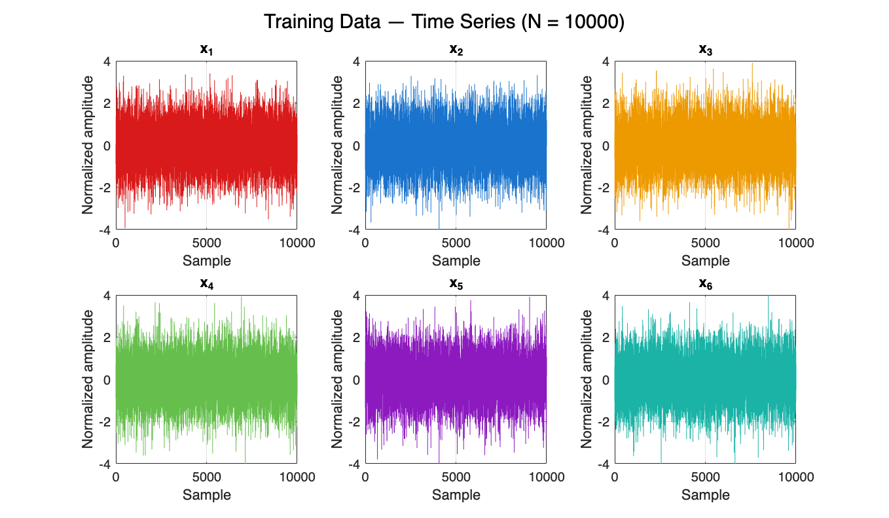
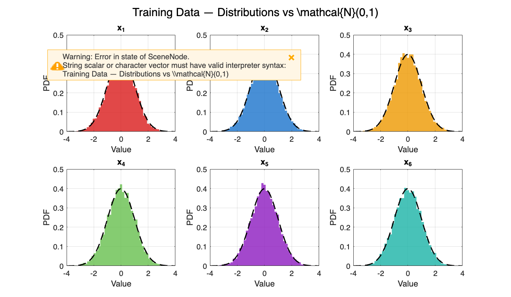
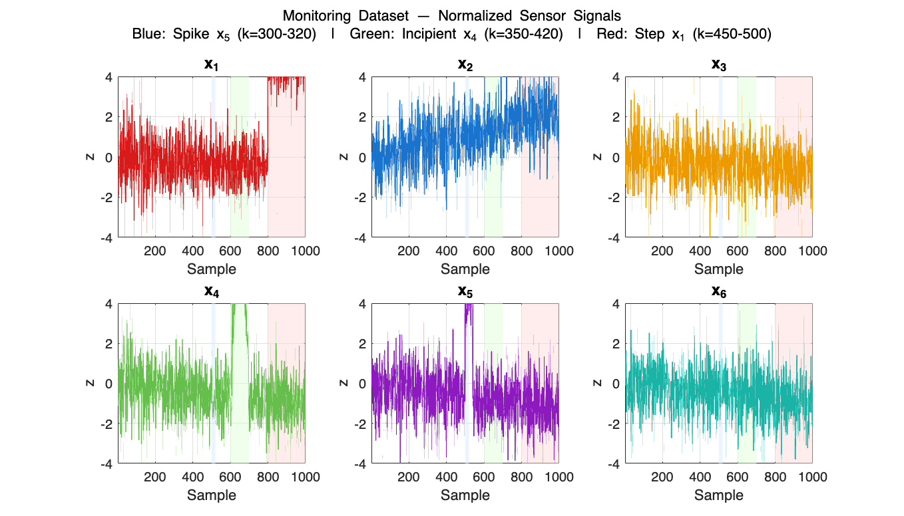

# **Data Preparation & Visualization**
# Recursive PCA for Adaptive Process Monitoring
# Li et al. (2000)  Recursive PCA
# A.Y. 2025/2026 | Amin Borqal, 1073928 | University of Bergamo
## **System Model :**
\matlabheadingtwo{ $$ x_k =At_k +\varepsilon ,~~t_k \in {\mathbb{R}}^3 ,~~x_k \in {\mathbb{R}}^6 $$ }
 $$ A=\left(\begin{array}{ccc} -0.2310 & -0.0816 & -0.2662\newline -0.3241 & 0.7055 & -0.2158\newline -0.2170 & -0.3056 & -0.5207\newline -0.4089 & -0.3442 & -0.4501\newline -0.6408 & 0.3102 & 0.2372\newline -0.4655 & -0.4330 & 0.5938 \end{array}\right) $$ 
## $A\in {\mathbb{R}}^{6\times 3}$ **— fixed loading matrix** 
\matlabheadingtwo{ $$ t_i \sim \mathcal{N}(0,\,\sigma_{t_i }^2 ),~~\sigma =[1.0,~0.8,~0.6] $$ }
\matlabheadingtwo{ $$ \varepsilon \sim \mathcal{N}(0,\,0.04) $$ }
```matlab

clc; clear;
rng(42)
close all

plots_dir = fullfile(pwd, 'plots');
if ~exist(plots_dir, 'dir')
    mkdir(plots_dir);
end

%% 1. System Definition — Eq. 50 (Li et al. 2000)
% 3 latent variables → 6 correlated sensors

A = [-0.2310, -0.0816, -0.2662;
     -0.3241,  0.7055, -0.2158;
     -0.2170, -0.3056, -0.5207;
     -0.4089, -0.3442, -0.8001;
     -0.6408,  0.3102,  0.2372;
     -0.4655, -0.4330,  0.5938];

sigma_t     = [1.0, 0.8, 0.6];   % latent variable std devs
sigma_noise = 0.2;                % sensor noise std dev
N           = 10000;              % training samples
m           = 6;                  % number of variables


```
# 2. Training Data — Stationary Healthy Process
```matlab

T_train = randn(N, 3) .* sigma_t;
X_train = T_train * A' + sigma_noise * randn(N, m);

% Standardize: zero mean, unit variance
mu    = mean(X_train);
sigma = std(X_train);
Z     = (X_train - mu) ./ sigma;
```
# 3. Monitoring Dataset — Time\-Varying Process + 3 Fault Types
|      |      |      |
| :-- | :-- | :-- |
| **Drift** <br>  | **Variable** <br>  | **Mechanism** <br>   |
| **Mean of t\_1 increases linearly** <br>  | **t\_1** <br>  | $\displaystyle \mu_{t_1 } =\textrm{linspace}(0,1.5,500)$ <br>   |
| **Correlation structure changes** <br>  | **A\_11** <br>  | $\displaystyle A_{11} (k)=A_{11} (0)+0.0002k$ <br>   |
| **Sensor mean drifts** <br>  | **x\_2** <br>  | $\displaystyle x_2 (k)=x_2 (k)+0.002k$ <br>   |
|      |      |       |

|      |      |      |      |      |
| :-- | :-- | :-- | :-- | :-- |
| **Fault** <br>  | **Samples** <br>  | **Sensor** <br>  | **Type** <br>  | **Magnitude** <br>   |
| **Impulsive** <br>  | **500–540** <br>  | **x\_5** <br>  | **Additive spike** <br>  | $\displaystyle +3\sigma_{x_5 }$ <br>   |
| **Incipient** <br>  | **600–700** <br>  | **x\_4** <br>  | **Sinusoidal growth** <br>  | $\displaystyle +3\sin (\pi (k-350)/70)$ <br>   |
| **Step** <br>  | **800–1000** <br>  | **x\_1** <br>  | **Permanent bias** <br>  | $\displaystyle +3\sigma_{x_1 }$ <br>   |
|      |      |      |      |       |


```matlab

%% 3. Monitoring Dataset — Time-Varying Process + 3 Fault Types

N2          = 1000;
X_mon       = zeros(N2, m);
X_mon_drift = zeros(N2, m);
GroundTruth = zeros(N2, 1);
mu_t1_vec   = linspace(0, 1.5, N2);
drift_A     = 0.0002;
drift_x2    = 0.002;

for k = 1:N2

    A_k      = A;
    A_k(1,1) = A(1,1) + k * drift_A;

    t_k    = randn(1,3) .* sigma_t;
    t_k(1) = t_k(1) + mu_t1_vec(k);

    x_k    = (A_k * t_k')' + sigma_noise * randn(1, m);
    x_k(2) = x_k(2) + k * drift_x2;

    X_mon_drift(k,:) = x_k;

    % Fault 1 — Impulsive on x5
    if k >= 500 && k <= 540
        x_k(5)         = x_k(5) + 5 * sigma(5);
        GroundTruth(k) = 1;
    end

    % Fault 2 — Incipient sinusoidal on x4
    if k >= 600 && k <= 700
        x_k(4)         = x_k(4) + 5 * sin(pi * (k-600) / 100);
        GroundTruth(k) = 1;
    end

    % Fault 3 — Permanent step on x1
    if k >= 800
        x_k(1)         = x_k(1) + 5 * sigma(1);
        GroundTruth(k) = 1;
    end

    X_mon(k,:) = x_k;
end

Z_mon       = (X_mon       - mu) ./ sigma;
Z_mon_drift = (X_mon_drift - mu) ./ sigma;

%% 3b. Single-fault datasets

X_mon_f1            = X_mon_drift;
X_mon_f1(500:540,5) = X_mon_f1(500:540,5) + 3 * sigma(5);
Z_mon_f1            = (X_mon_f1 - mu) ./ sigma;

X_mon_f2 = X_mon_drift;
for k = 600:700
    X_mon_f2(k,4) = X_mon_f2(k,4) + 3 * sin(pi*(k-600)/100);
end
Z_mon_f2 = (X_mon_f2 - mu) ./ sigma;

X_mon_f3            = X_mon_drift;
X_mon_f3(800:1000,1) = X_mon_f3(800:1000,1) + 3 * sigma(1);
Z_mon_f3            = (X_mon_f3 - mu) ./ sigma;
```
# 4. Visualization — Training Data
```matlab

var_names  = {'x_1','x_2','x_3','x_4','x_5','x_6'};
arrow_cols = [0.85 0.10 0.10;
              0.10 0.45 0.80;
              0.93 0.60 0.00;
              0.40 0.75 0.30;
              0.55 0.10 0.75;
              0.10 0.70 0.65];

fig1 = figure('Position', [100 100 1200 700]);
for i = 1:m
    subplot(2,3,i)
    plot(Z(:,i), 'Color', arrow_cols(i,:), 'LineWidth', 0.5)
    title(var_names{i})
    xlabel('Sample'); ylabel('Normalized amplitude')
    ylim([-4 4])
    grid on; box on
end
sgtitle('Training Data — Time Series (N = 10000)')
```



```matlab

fig2 = figure('Position', [100 100 1200 700]);
for i = 1:m
    subplot(2,3,i)
    histogram(Z(:,i), 50, 'FaceColor', arrow_cols(i,:), ...
              'EdgeColor', 'none', 'FaceAlpha', 0.8, 'Normalization', 'pdf')
    hold on
    x_range = linspace(-4, 4, 200);
    plot(x_range, normpdf(x_range, 0, 1), 'k--', 'LineWidth', 1.5)
    title(var_names{i})
    xlabel('Value'); ylabel('PDF')
    xlim([-4 4]); grid on; box on
end
sgtitle('Training Data — Distributions vs \mathcal{N}(0,1)')
```


# 5. Visualization — Monitoring Dataset

```matlab
%% 5. Visualization — Monitoring Dataset

% Safety check
if ~exist('m', 'var'), load('monitoring_data.mat'); end

fault_regions = [500 520; 600 700; 800 1000];
fault_colors  = [0.85 0.92 1.00;
                 0.88 1.00 0.85;
1.00 0.85 0.85];
fault_labels  = {'Fault 1: Spike x_5 (k=500-540)', ...
                 'Fault 2: Incipient x_4 (k=600-700)', ...
                 'Fault 3: Step x_1 (k=800-500)'};

y_lim = [-4 4];

figure('Position', [100 100 1400 800]);

for i = 1:m
    subplot(2,3,i); hold on

    for f = 1:3
        fill([fault_regions(f,1) fault_regions(f,2) ...
              fault_regions(f,2) fault_regions(f,1)], ...
             [y_lim(1) y_lim(1) y_lim(2) y_lim(2)], ...
             fault_colors(f,:), 'EdgeColor', 'none', 'FaceAlpha', 0.5)
    end

    plot(Z_mon(:,i), 'Color', arrow_cols(i,:), 'LineWidth', 0.9)

    xlabel('Sample'); ylabel('z')
    title(var_names{i}, 'FontSize', 12, 'FontWeight', 'bold')
    xlim([1 N2]); ylim(y_lim)
    grid on; box on
end

sgtitle({'Monitoring Dataset — Normalized Sensor Signals', ...
         'Blue: Spike x_5 (k=500-540)  |  Green: Incipient x_4 (k=600-700)  |  Red: Step x_1 (k=800-500)'}, ...
        'FontSize', 11)

exportgraphics(gcf, fullfile(plots_dir, 'monitoring_signals.png'), 'Resolution', 300)
```



# 6. Save
```matlab
%% 6. Save

save('monitoring_data.mat', ...
    'A', 'mu', 'sigma', 'Z', ...
    'X_mon',       'Z_mon',       'GroundTruth', ...
    'X_mon_drift', 'Z_mon_drift', ...
    'X_mon_f1',    'Z_mon_f1',    ...
    'X_mon_f2',    'Z_mon_f2',    ...
    'X_mon_f3',    'Z_mon_f3',    ...
    'N', 'N2', 'm', 'sigma_t', 'sigma_noise', ...
    'var_names', 'arrow_cols', ...
    'fault_regions', 'fault_labels', 'fault_colors')

fprintf('monitoring_data.mat saved.\n')
```

```matlabTextOutput
monitoring_data.mat saved.
```
